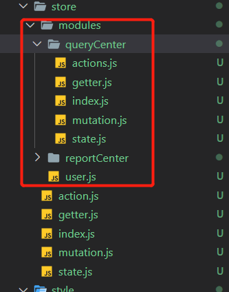

## 一、module 结构：
 

如上图：modules 中有多个文件夹或者多个js文件，单独的文件夹里面又有多个js文件，这样可以把模块化的状态对象分类整理比较容易管理，避免混乱。 

例如此图： queryCenter是一个模块，reportCenter是一个模块，user.js也是一个模块。

注意: 图片中的modules 只是纯文件夹，名字不是定死的
## 二、定义模块
### 1,模块内多个单独的包含状态对象的js?
这种形式是把多个单独的模块放在一个js这种再作为一个模块导出，例如：
模块data1.js
```javascript
export default {
    state:{
      name:100,
      age:200,
      num:100
    },
    mutations:{
   
    },
    actions:{
    
    },
    getters:{

    }
     }
```
模块data2.js
```javascript
export default {
    state:{
      name1:100,
      age1:200,
      num1:100
    },
    mutations:{
   
    },
    actions:{
   
    },
    getters:{

    }
     }

```
模块data3.js
```javascript
export default {
    state:{
      name3:100,
      age3:200,
      num3:100
    },
    mutations:{
    
    },
    actions:{
    },
    getters:{

    }
     }
```
最后引入index.js中导出：
```javascript
import data1 from './data1'
import data2 from './data2'
import data3 from './data3'
export default {
    namespaced: true,
    modules: {
        data1,
        data2,
        data3
        }
    }
```
注意index.js中要使用namespaced选项，另外，其他引入的模块放在modules选项中
### 2，单独一个文件作为一个模块，包含多个状态对象？
例如模块 user.js 
```javascript
export default {
    state:{
      uname:'tom',
      uage:30,
      unum:100
    },
    mutations:{
   
    },
    actions:{
   
    },
    getters:{

    },
   
}
```
这种就是把一个模块放在一个js文件中定义然后导出
### 3,模块内将状态对象拆分为单独的js文件？
这种就是把state,actions,mutations等对象放在单独的文件里面，再统一通过index.js导出。避免数据太大，比较混乱,例如

单独定义 actions:
```javascript
 const actions={
	
	testSub:function(context,plaload){ //倒计时，异步操作
      setTimeout(() => {
		context.commit('subNum',plaload) 
	  }, 2000);
	}
}
export default actions
```
单独定义getters:
```javascript
const getters={
    
   }
export default getters 
```
单独定义mutation：
```javascript
const mutations={  
	add(state,t){
		state.data1=state.data1+t
	},
	}
export default  mutations
```
等等。。。

再通过当前目录的index.js导出： 
```javascript
import state from './state'
import actions from './actions'
import mutations from './mutation'
import getters from './getter'
export default{
    state,actions,mutations,getters
}
```
这种其实和第2中相同，只不过是第二种把action,state状态对象放在了单独的js 文件里
## 三，模块的局部状态对象的定义
### 1,getter
getter 的话，他会有三个参数，第一个是模块内的 state，第二个是 模块内的 getters，第三个是根节点状态state:rootState,第四个是根节点的getters:rootGetters,例如模块data1.js: 
```javascript
export default {
  namespaced:true,
    state:{
      name:100,
      age:200,
      num:100,
      str:''
    },
    mutations:{
   
    },
    actions:{
    
    },
    getters:{
      getState(state, getters, rootState,rootGetters){  //getters方法，rootState指的是全局中的state
       state.str=`state:${},getters:${getters},rootStete:${rootState},rootGetters${rootGetters}` 
      }
    }
     }

```
### 2,mutation
```javascript
```
### 3,action
```javascript
```
## 四，使用
### 1，state 数据的获取
```javascript
```
## 五，命名空间
### 0，为何要使用命名空间？

### 1，设置命名空间

```javascript
```
### 2，组件中访问设置了命名空间的模块的状态对象
0，访问state:
```vue
 <div class="border-box">
                <div>{{`reportCenter.data1.name: ${this.$store.state.reportCenter.data1.name}`}}</div>
                <div>{{`reportCenter.data1.age: ${this.$store.state.reportCenter.data1.age}`}}</div>
                <div>{{`reportCenter.data1.num: ${this.$store.state.reportCenter.data1.num}`}}</div>
                <div>{{`user.uname: ${this.$store.state.user.uname}`}}</div>
           </div>
```
使用this.$store.state后面+模块名称
1,执行dispatch

methods:{
  setStr(){
    this.$store.dispatch({type:'reportCenter/data1/setStr1',data:500}) 
      }
    }
```
或者：
```javascript
methods:{
  setStr(){
    this.$store.dispatch('reportCenter/data1/setStr1',{data:500})
      }
    }
```
第一个参数是触发的action中的方法名，但是需要带上模块名称，例如这里使用了“reportCenter/data1/setStr1”，标识执行了模块reportCenter下面的模块data1的actions 方法 setStr1 

2,执行commit
```javascript
methods:{
 setStr2(){
         this.$store.commit({type:'reportCenter/data1/setStr2',data:500})
        }
     }
```
和dispatch的参数用法相同

3，访问getters:
```vue
 <div class="border-box"> 
    <div>{{`getters: ${this.$store.getters["reportCenter/data1/getState"]}`}}</div>
</div>
```
```javascript

```
...mapState()
```javascript
  computed:{
     ...mapState('reportCenter/data1', {
       name:state=>state.reportCenter/data1.name,
       age:state=>state.reportCenter/data1.age,
       num:state=>state.reportCenter/data1.num
      })
  }
```
...mapAction()
```javascript
...mapActions([
    'reportCenter/data1/aa', 
    'reportCenter/data1/bb' 
  ])
```
mapGetters()
```javascript
```
mapMutations()
```javascript
```

也是前面加上模块名称
### 3，模块中的辅助函数的使用
上面的方式会计较繁琐，可以使用以下方式，模块名作为第一个参数，后面是具体的数据或者方法
...mapState()
```javascript
computed:{
     ...mapState('reportCenter/data1', {
       name:state=>state.name,
       age:state=>state.age,
       num:state=>state.num,
      })
  }
```
...mapAction()
```javascript
...mapActions('reportCenter/data1',[
    'aa', 
    'bb' 
  ])
```
只设置第一个参数为模块名称，中括号里面写方法名称
mapGetters()
```javascript
```
mapMutations()
```javascript
```
### 4，使用createNamespacedHelpers映射到命名空间

### 5，在带命名空间的模块内访问全局内容
```javascript
```
### 6，将模块内的 action 注册为全局
### 7，插件开发者的注意事项
## 六，模块动态注册
### 1,注册
```javascript
```
### 2,访问
```javascript
```
### 3,卸载
```javascript
```
### 4,保留 state
```javascript
```
## 七，模块重用
```javascript
```
 